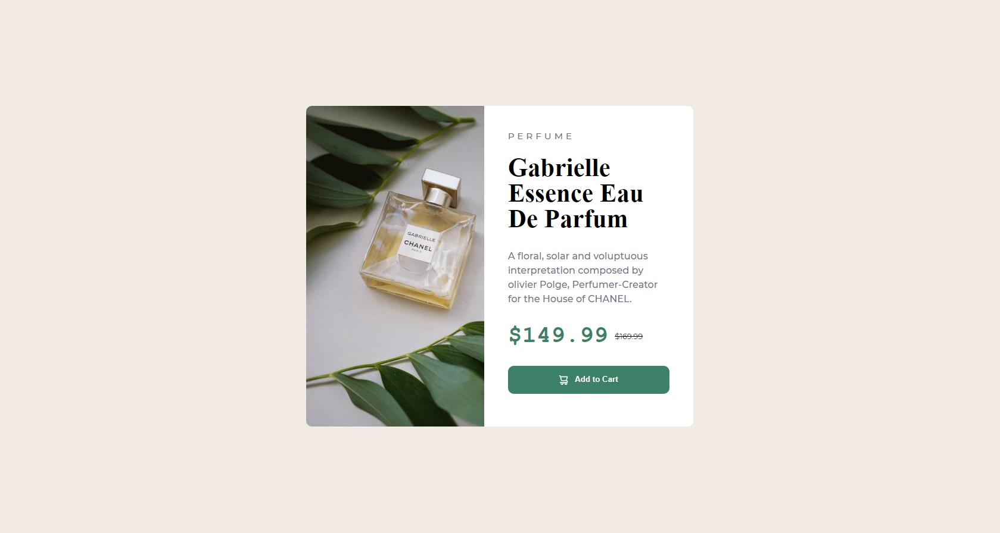

# Frontend Mentor - Product preview card component solution

This is a solution to the [Product preview card component challenge on Frontend Mentor](https://www.frontendmentor.io/challenges/product-preview-card-component-GO7UmttRfa). Frontend Mentor challenges help you improve your coding skills by building realistic projects. 


### Screenshot




### Links


- Live Site URL: [Add live site URL here](https://ortonb110.github.io/Cardcomponent/)

## My process

### Built with

- Semantic HTML5 markup
- CSS custom properties
- Flexbox
- CSS Grid
- Mobile-first workflow


### What I learned

Learnt how to properly center content on a page, and also using the picture element and not background-image property to use different images during different breakpoint.

```html
<h1>Some HTML code I'm proud of</h1>
```
```css
.proud-of-this-css {
  color: papayawhip;
}
```
```js
const proudOfThisFunc = () => {
  console.log('🎉')
}
```


## Author

- Website - [codewithorton.com](https://www.codewithorton.com)
- Frontend Mentor - [@ortonb110](https://www.frontendmentor.io/profile/ortonb110)
- Twitter - [@BrightKwabOrton](https://www.twitter.com/BrightKwabOrton)


